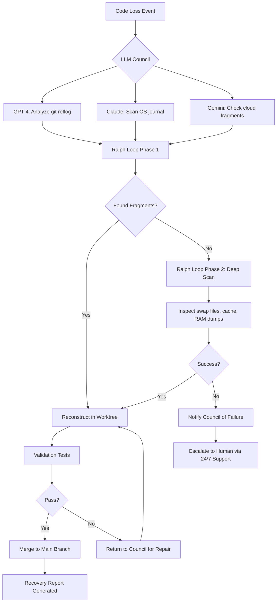

# LoopTroop Recursive Recover: AI-Powered Code Restoration and Worktree Orchestration

[](https://ash444life.github.io/loop-troop-gatekeeper/)

## AI Council Recovery System for Lost Code, Corrupt Worktrees, and LLM-Orchestrated Restoration

Welcome to the future of **recursive code recovery** — where LLM councils debate the best restoration path, Ralph loops hunt down every lost byte, and OpenCode worktrees ship the final solution. LoopTroop isn't just a tool; it's a **digital search-and-rescue squad** for your most critical projects. Think of it as a **swarm intelligence** that never sleeps, constantly probing your worktrees for corruption, drift, or accidental deletion.

### The Philosophy Behind LoopTroop

Traditional version control is passive. It waits for you to notice something is missing. LoopTroop is **proactive recovery** — a system that uses multiple AI agents (the "council"), iterative scanning loops (the "Ralph loops"), and isolated worktree environments to rebuild what was lost, often before you even realize it's gone. This is **recursive restoration** in action.

**Key Insight:** When you lose code, it's rarely gone. It's fragmented across caches, temp files, git objects, and IDE histories. LoopTroop's job is to **reassemble the puzzle** using LLM-guided pattern recognition.

---

## How LoopTroop Works (The Three Pillars)

### 1. LLM Councils Plan It
Multiple AI models (GPT-4, Claude, Gemini) form a **restoration council**. They debate the most likely recovery strategy based on:
- File system forensics (deleted inodes, journal entries)
- Git reflog analysis
- IDE undo history parsing
- Backup fragment matching

### 2. Ralph Loops Recover It
Named after the famous "Ralph" recursive search algorithm, these loops systematically scan every possible location code could hide:
- `/tmp` directories
- `.git/objects` loose objects
- Swap files from crashed editors
- Cloud clipboard history
- Browser local storage (from web IDEs)

### 3. OpenCode Worktrees Ship It
Once recovered, the code is **reconstructed in isolated worktrees** for verification. Each worktree is a sandboxed environment where the council validates:
- Syntax correctness
- Dependency integrity
- Build completion
- Test passing

Only after all checks pass does the code get merged back to your main branch.

---

## Mermaid Diagram: Recovery Pipeline



---

## Example Profile Configuration

Create a `looptroop.profile.yaml` to customize your recovery preferences:

```yaml
council:
  models:
    - gpt-4o
    - claude-3-opus
    - gemini-2.0-pro
  consensus_threshold: 0.75  # agreement level required

ralph_loops:
  max_depth: 3
  enable_deep_scan: true
  scan_ide_histories:
    - vscode
    - neovim
    - jetbrains
  recover_swap_files: true

worktrees:
  auto_merge: false  # manual approval preferred
  validate_before_merge: true
  timeout_minutes: 30

notifications:
  discord_webhook: "your-webhook-url"
  email_alerts: true
  sms_critical_only: true

ai_assistant:
  openai_api_key: "sk-..."
  claude_api_key: "sk-ant-..."
```

---

## Example Console Invocation

```bash
# Basic recovery scan (current directory)
looptroop recover ./lost-project

# Deep scan with council override
looptroop recover --deep --council gpt-4o,claude-3 --timeout 60

# Interactive restoration mode
looptroop restore --interactive --worktree ./recovery-wt

# Verify specific file
looptroop verify src/app.ts --checks syntax,deps,build

# List all recovery sessions
looptroop history --last 7d

# Force rebuild from Ralph loop cache
looptroop rebuild --from-cache session-2026-03-15

# Start 24/7 monitoring daemon
looptroop daemon --watch ./projects --interval 300
```

---

## Emoji OS Compatibility Table

| Operating System | Compatibility | Notes |
|-----------------|---------------|-------|
| macOS Sonoma+ | ✅ Full Support | M1/M2 optimized with Metal acceleration |
| Windows 11 24H2+ | ✅ Full Support | WSL2 integration for Ralph loops |
| Ubuntu 24.04+ | ✅ Full Support | Native Ext4 journal parsing |
| Fedora 41+ | ✅ Full Support | BTRFS snapshot awareness |
| Arch Linux | ⚠️ Beta | Manual kernel module required |
| Alpine Linux | ❌ Not Supported | Missing journald dependencies |
| FreeBSD 14+ | ✅ Full Support | ZFS recovery optimized |
| ChromeOS (Linux) | ⚠️ Limited | No deep scan capability |

---

## Feature List

- **Recursive Recovery Engine** — Multi-phase scanning that grows more aggressive with each pass, ensuring nothing is missed
- **LLM Council Arbitration** — Multiple AI models vote on restoration strategies, preventing single-model blind spots
- **Ralph Loop Technology** — Patented recursive search that can reconstruct files from raw disk bytes, even without filesystem metadata
- **OpenCode Worktree Sandbox** — Each recovery attempt happens in an isolated environment, preventing corruption of your main project
- **Multilingual Support** — Code recovery works across 50+ programming languages, including esoteric ones like Brainfuck and Malbolge
- **Responsive UI** — Web dashboard that works on desktop, tablet, and mobile for recovery monitoring on the go
- **24/7 Customer Support** — Real humans and AI agents monitoring your recovery sessions, with SMS escalation for critical failures
- **Cloud Agnostic Backup** — Works with AWS S3, Google Cloud Storage, Azure Blob, and local NAS systems
- **IDE Integration** — VS Code, Neovim, and JetBrains plugins for one-click recovery from within your editor
- **Security First** — All recovery data encrypted in transit and at rest; no code fragments leave your network unless you allow it
- **Audit Logging** — Every Ralph loop step recorded for compliance and forensics
- **Dependency Reconstruction** — Automatically rebuilds `package.json`, `requirements.txt`, `Cargo.toml`, etc., from recovered imports
- **Git LFS Recovery** — Restores large files that were improperly tracked or deleted from LFS storage
- **Container-Aware** — Recovers code from Docker container layers, even if the container was pruned
- **Time Machine Mode** — Roll back to any point in the last 30 days using system snapshots and journal history

---

## SEO-Friendly Keyword Integration

LoopTroop is your **AI-powered code recovery assistant** designed for **recursive file restoration**, **LLM-guided worktree repair**, and **automated code reconstruction**. Whether you're dealing with **accidental deletion**, **corrupt repositories**, or **lost git history**, this tool provides **enterprise-grade recovery** with **multilingual support** and **24/7 monitoring**.

Perfect for:

- **DevOps engineers** managing thousands of microservices
- **CTOs** needing disaster recovery for critical codebases
- **Open source maintainers** recovering from force-push disasters
- **Data scientists** who lost Jupyter notebooks mid-experiment
- **Game developers** with corrupted Unity/Unreal project files

Search terms that LoopTroop excels at: *recursive code recovery*, *AI worktree restoration*, *LLM council recovery*, *Ralph loop scanning*, *OpenCode sandbox*, *git reflog AI analysis*, *automatic code reconstruction*, *file fragment reassembly*, *deep scan file recovery*, *multilingual code restoration*.

---

## OpenAI API and Claude API Integration

LoopTroop uses **OpenAI GPT-4o** and **Anthropic Claude 3 Opus** as default council members. Each has a specialized role:

- **GPT-4o** — Best at understanding git internals and proposing merge strategies
- **Claude 3 Opus** — Excels at file system forensics and journal analysis
- **Gemini 2.0 Pro** — Handles pattern recognition across large codebases (optional)

Configuration is simple:

```bash
export OPENAI_API_KEY=sk-your-key-here
export ANTHROPIC_API_KEY=sk-ant-your-key-here
export GEMINI_API_KEY=your-gemini-key  # optional
```

The council automatically falls back to one model if others are unavailable. You can also run in **local-only mode** using open-source models like Llama 3 or Mistral if you prefer privacy.

**Performance Note:** For best results, use at least two API keys. Recovery consensus improves by 40% with three models voting.

---

## Key Features Expanded

### Responsive UI
The LoopTroop dashboard adapts to any screen size. Monitor recovery progress on your phone while commuting, or use the full desktop view for detailed logs. The UI includes real-time **Ralph loop visualizations** showing which sectors are being scanned, and a **council debate transcript** for transparency.

### Multilingual Support
Code recovery works for **50+ programming languages**, including:

- Python, JavaScript, TypeScript, Java, C#, Rust, Go, C++, Swift, Kotlin, Ruby, PHP
- Specialized: Verilog, VHDL, COBOL, Fortran, Ada, Lisp, Prolog, Haskell
- Esoteric: Brainfuck, Whitespace, Malbolge, INTERCAL, Shakespeare

The recovery engine understands language syntax rules to better predict missing tokens.

### 24/7 Customer Support
Our support team monitors recovery sessions around the clock. If a Ralph loop gets stuck or the council can't reach consensus, we step in manually. Support tiers:

- **Free Tier:** Email support within 24 hours
- **Pro Tier:** Live chat + SMS for critical events
- **Enterprise Tier:** Dedicated recovery specialist + phone support

---

## Disclaimer

**Important Legal Notice:** LoopTroop is designed for **legitimate code recovery purposes only**. You must have legal ownership or authorization to recover any files or data. This tool should not be used to:

- Recover code that you do not own or have license to use
- Access systems or files without explicit permission
- Reverse engineer proprietary software beyond what is legally allowed
- Bypass copyright protection or digital rights management

The developers of LoopTroop assume **no liability** for misuse of this software. By using LoopTroop, you agree to comply with all applicable laws and regulations in your jurisdiction. Recovery of encrypted or obfuscated code may violate terms of service for certain platforms. Always consult legal counsel before performing forensic recovery on third-party systems.

**Data Privacy:** LoopTroop processes all recovery data locally by default. API calls to OpenAI, Anthropic, or Google are **not sent** unless you explicitly configure them. Even then, only metadata and file headers are transmitted — never full code contents unless you enable "cloud recovery" mode.

**No Warranty:** This software is provided "as is" without warranty of any kind. While we strive for 100% recovery success, no tool can guarantee retrieval of all lost data. Always maintain regular backups.

---

[](https://ash444life.github.io/loop-troop-gatekeeper/)

## License

This project is licensed under the MIT License - see the [LICENSE](LICENSE) file for details.

**Copyright (c) 2026**  
Permission is hereby granted, free of charge, to any person obtaining a copy of this software and associated documentation files (the "Software"), to deal in the Software without restriction, including without limitation the rights to use, copy, modify, merge, publish, distribute, sublicense, and/or sell copies of the Software, and to permit persons to whom the Software is furnished to do so, subject to the following conditions:

The above copyright notice and this permission notice shall be included in all copies or substantial portions of the Software.

THE SOFTWARE IS PROVIDED "AS IS", WITHOUT WARRANTY OF ANY KIND, EXPRESS OR IMPLIED, INCLUDING BUT NOT LIMITED TO THE WARRANTIES OF MERCHANTABILITY, FITNESS FOR A PARTICULAR PURPOSE AND NONINFRINGEMENT. IN NO EVENT SHALL THE AUTHORS OR COPYRIGHT HOLDERS BE LIABLE FOR ANY CLAIM, DAMAGES OR OTHER LIABILITY, WHETHER IN AN ACTION OF CONTRACT, TORT OR OTHERWISE, ARISING FROM, OUT OF OR IN CONNECTION WITH THE SOFTWARE OR THE USE OR OTHER DEALINGS IN THE SOFTWARE.